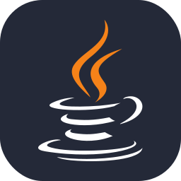
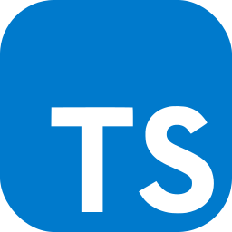
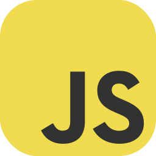
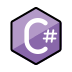
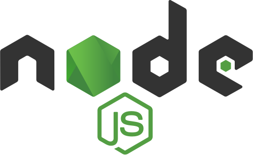

### Hello and welcome! 👋

I am Mehdi, a passionate programmer and technical explorer. With a background in Computer Engineering, I strive to continually learn and grow within my field. On this page, I share my projects, code snippets,and explorations whithin the world of technology.

- 👨‍🎓 Studing at Chalmers University of technology
- 🌱 I’m currently learning Linux administration
- 🤟 Love Linux and Open-source software
- 🤔 Interested in security, network and hardware

---

#### Key skills:

#### Coded even in:

#### used tools:

---

#### contact:

You can send me a message by
